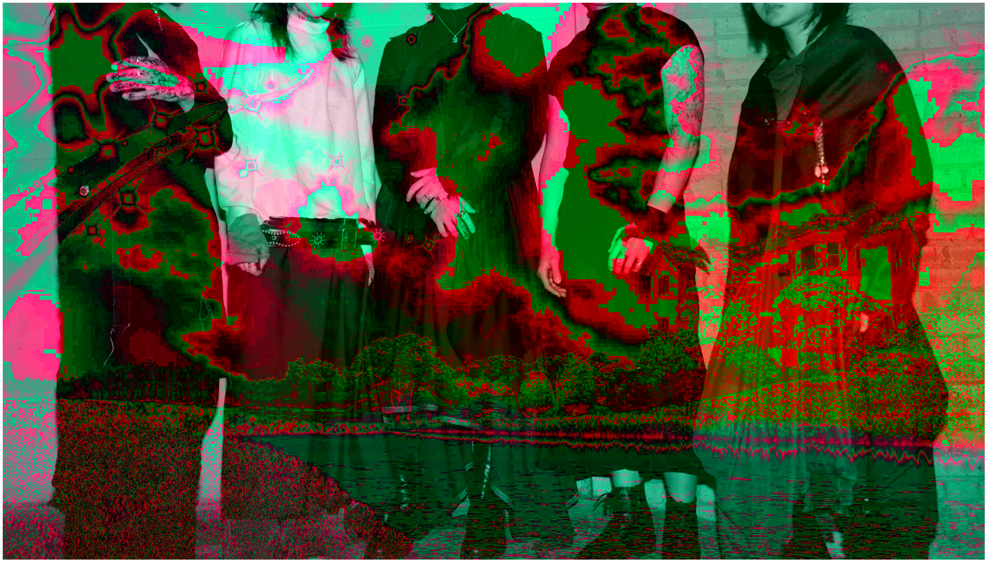
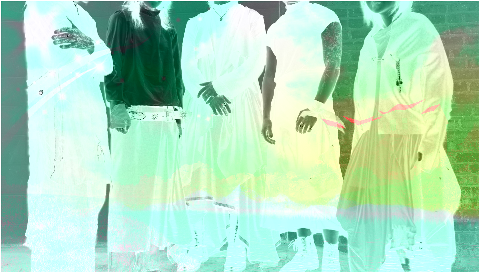

# channelblast

Script to multiply and combine different YCrCb channels into one image. Draws Y channel from default photo, Cr from uploaded image 1 and Cb from uploaded image 2. Multiplies channels by given multiple and bit inverts if selected. Different sized photos are stretched to the largest size. Images can be inspected at a pixel level using tools on the right of figure. Images can also be saved through the same toolbar. 

Examples with default images. 

To use, download web.py and photos folder. Run the following command in terminal. Multiple instances can be run at once. It can also be hosted on a box if you hope to use it non locally.  

<pre><code>bokeh serve --show web.py</code></pre>
