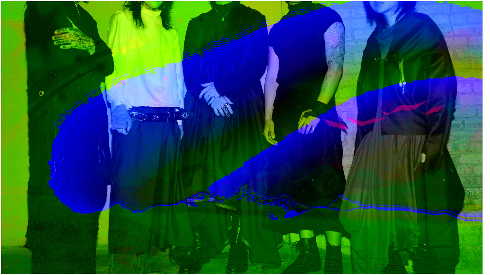
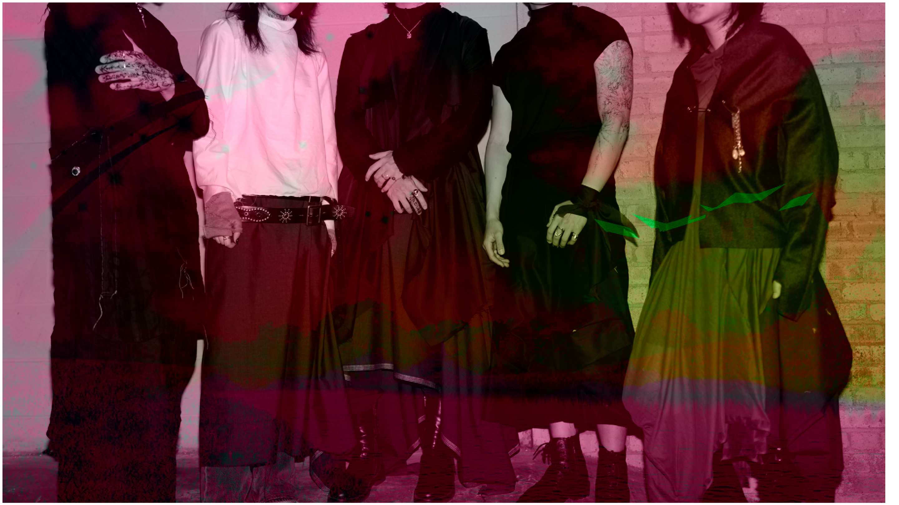
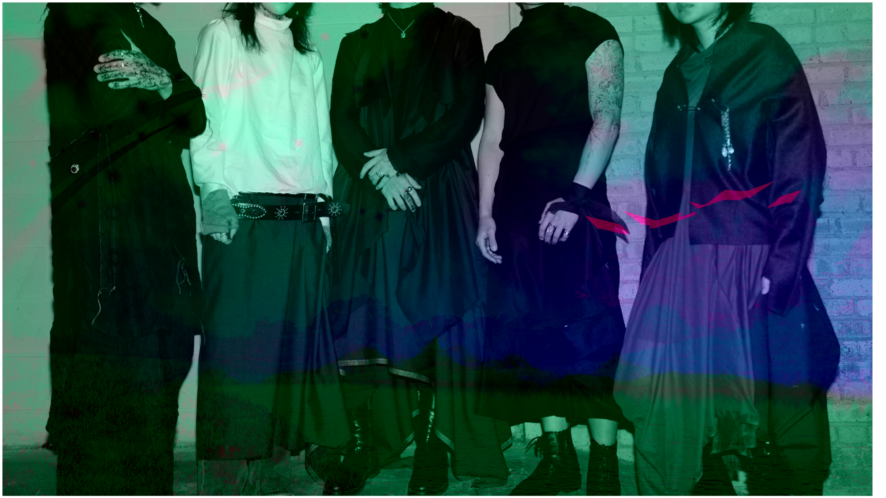

# channelblast

Script to multiply and combine different YCrCb channels into one image. Fraws Y channel from default photo, Cr from uploaded image 1 and Cb from uploaded image 2. Multiplies channels by given multiple and bit inverts if selected. Different sized photos are stretched to the largest size. Images can be inspected at a pixel level using tools on the right of figure. Images can also be saved through the same toolbar. 

Examples with default images. 

MULT1 = 10

MULT2 = 10

MULT3 = 10

INV Y

INV Cr

INV Cb

